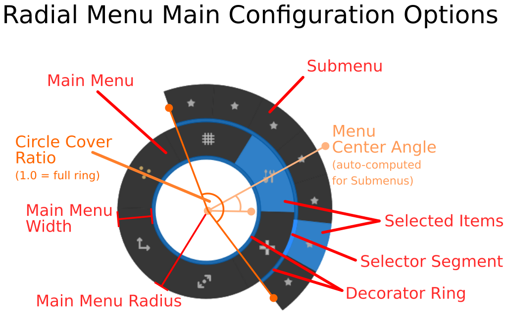

Radial Menu Control
===================

This code provides a radial menu control node for the Godot Engine. The control
is configurable to adapt to your needs. It supports keyboard, mouse, touch and gamepad input, though gamepad input is rudimentary.

Required files
--------------

The main work is done by the script `RadialMenu.gd`. It has several dependencies:  `drawing_library.gd` and `default_theme.tres` are required. You need to copy at least these three files into your own projects to get a working RadialMenu control. Also copy the `addons/RadialMenu/icons` folder or create your own. The icons inside it are referenced in the code and there is currently no way to reconfigure these, but replacing the icons with your own should work.

 `radial_menu_plugin.gd` and `plugin.cfg` are there for plugin initialisation if you want to use the RaidalMenu control via the Godot plugin system. Instead of using the plugin, you can also instance `RadialMenu.tscn` in your scene to get a preconfigured radial menu. 

 All other files, including those under `addons/RadialMenu/Demo`, are completely optional.

Setup
-----

There are three alternative ways to set up your radial menu:
   
   1. Activate the RadialMenu *plugin* in your project settings and then add a radial menu to your scene tree using the new RadialMenu node that should become available with plugin activation.

   2. Preload the RadialMenu.gd Script in your script and then create a new RadialMenu
      via script:

    # Preload the script and call it 'RadialMenu'
    const RadialMenu = preload("path_to/addons/RadialMenu/RadialMenu.gd")
    ...
    # create a radial menu
    menu = RadialMenu.new()

   3. Instance the provided `RadialMenu.tscn` scene in your own scene tree. The 
      scene contains a single Popup Node that has the `RadialMenu.gd` script attached.

Note that adding children to the RadialMenu node currently has no effect, but this may change in later versions, so *do not add children to a radial menu* in your scene tree if you want to make sure later versions will still work.

The radial menu control node inherits from the builtin Popup node and as such has all the behaviour of popups.  This means that you must provide some code to *open* the popup; the radial menu is hidden by default when you run the scene.

There are three Demo scenes under `addons/RadialMenu/Demo/RadialDemo.tscn` that show you how to configure a main menu and a couple of submenus. 

The radial menu comes preconfigured with 7 dummy entries with star icons which you must reconfigure in order to make it usable. If your menu shows 7 star items, you've forgotten to configure the menu items.

Menu items are configured as a list of dictionaries:

    var items = [
       {'texture': SOME_TEXTURE, 
        'title': 'A short title', 
        'action': 'anything, really'
       },
       ...
    ]
    # assuming that menu references your RadialMenu node...
    menu.set_items(items)

The method `set_items` takes such a list and reconfigures the menu items. You can also manipulate the `menu_items`-property directly.

If the value for an item's action key is a RadialMenu node, it will be treated as a **submenu** and opened when the menu item is activated. See `RadialDemo3.tscn` for an example.

Signals
-------

A radial menu control node emits three kinds of signals:

   1. `item_selected(action, position)`

   2. `item_hovered(menu_item)`

   3. `cancelled()`

The `item_selected` signal is emitted when a menu item is chosen and 
accepted via one of the supported input methods. `position` returns the original position at which the menu was opened via a call to `open_menu`.

The `item_hovered` signal is emitted when a menu item is selected but not yet
accepted as the user's choice; for example when the mouse first hovers over it.

The `cancelled` signal is emitted when the user closes the menu without having
made a choice.

No special signal is emitted when a submenu is openend. If you are interested 
interested in that event, you can use the `about_to_show` signal provided by 
the popup.

Configuration options
---------------------

The main parameters of a radial menu are its radius (always measured from the center to the the outermost edge) and the width of the ring that holds the items. The radial menu doesn't have to be a full ring; you can also configure it as an arc. The center of the arc can be configured to sit at any angle.

Colors and some size constants such as the width of the decorator ring/arc and the selector segment can be configured via themes. See the provided dark theme for an example.

Public Properties
-----------------

All the following properties are considered to belong to the public interface; you can acess and change these properties at will. All of these properties except `menu_items` are also exported and therefore can be changed directly in the Godot editor.

    menu_items

A list of dictionaries containing 'texture', 'title' and 'action' keys (at least). You can
also use the `set_items` method instead.

    radius 

Sets the radius of the menu.

    width

Sets the width of the ring that holds the menu items.

    center_radius

Sets the radius of the center ring. If you set it to 0, the center won't be drawn.

    circle_coverage : float

Determines how much of a full circle the menu covers. Must be a value between 0 and 1, though values below a certain treshold (the exact number varies depending on radius, width etc) don't make sense.

    center_angle : float

Sets the angle where the center of the radial arc is located. Values are in radians. The default is -PI/2, e.g. the arc is centered at 12 o'Clock.

    selector_position 

Sets the position of the selector. It's either `Position.off`, `Position.inside` (default), or `Position.outside`.

    decorator_position

Sets the position of the decorator ring. It's either `Position.off`, `Position.inside` (default), or `Position.outside`.

    show_animation : bool

A boolean which controls whether animations are enabled (default) or disabled. 

    animation_speed_factor: float

This changes the speed of the animation. Smaller values get you a faster animation. Ignored if `show_animation` is false.

    outside_selection_factor : float

A float which determines how far beyond the ring the mouse can be and still select a menu item. The factor is in ring widths, so a value of 0 means the mouse won't select outside of the ring at all, and 1 means the mouse will select up to a full ring width beyond the outer edge of the ring. Defaults to 3.

    icon_scale : float

Factor by which icons are scaled. This is applied to all textures provided via `menu_items`. Defaults to 1.

    default_theme : Theme

Provides default values for colors and some constants which are used unless another active theme has entries for RadialMenu, which will override those of the default theme. Two example themes are provided; one is used as the default automatically. You don't need to bother with the default theme property if you're providing your own theme - you can just use the `theme` property instead.

Public Methods
--------------

    set_items(items)

Sets all menu items at once. You can also set the `menu_items` property directly.

    open_menu(center_position: Vector2)

Opens the RadialMenu (e.g. makes it visible at the given position). Do not place the menu yourself and call `show()`; use this method instead.

    add_icon_item(texture : Texture, title: String, action)

Adds an item represented by an icon to the menu. Note: Calling add_icon_item is
less efficient than setting all items at once via set_items.

    set_item_text(idx: int, title: String)

Sets the text of a single menu item. The item must exist already.

    set_item_action(idx: int, action)

Sets the action of a single menu item. The item must exist already.

    set_item_icon(idx: int, texture: Texture)

Sets the icon of a single menu item. The item must exist already.

    select_next()

Selects the next item in clockwise order.

    select_prev()

Selects the previous item in clockwise order (e.g. the next counterclockwise).

    has_open_submenu()

Returns true if a submenu is active, false if not.

    get_open_submenu()

Returns the submenu object if one is currently active, or null.

    setup_gamepad(deviceid : int, xaxis: int, yaxis: int, deadzone: float)

Sets the gamepad device id, x-axis and y-axis that controls the radial menu. 
Deadzone defaults to 0.2.

UI considerations
-----------------

Don't pack more than a handful of items into a radial menu, especially when you don't cover the whole ring and when users use gamepads to select items, since it gets harder to select items as the selection angle narrows, and most people's brains have to actually work at processing more than, say, 5-7 items.

Also, currently stacking multiple radial submenus doesn't quite work (though it might in a later version, the code *almost* allows it); but this seems like a bad idea from a UI design standpoint. Finally, if you enable the menu animation, you might want to provide the user with a way to turn the animation off, because it _does_ slow down some people.

Input handling details
----------------------

The menu navigation reacts to some of the default actions Godot provides:
  
  `ui_cancel` closes a submenu or the main menu without choosing an item.
  `ui_accept` accepts the currently selected choice.
  `ui_focus_next` and `ui_focus_prev` select items clockwise and counterclockwise. `ui_down` and `ui_right` also select clockwise, `ui_up` und `ui_right` counterclockwise.

This takes care of both the keyboard and some of the gamepad navigation.

The mouse wheel also works to select items clockwise and counterclockwise. Moving the mouse back to the center deselects any selection made in the currently active menu; moving it far beyond the menu ring/arc also deselects. You can configure the radius at which deselection happens _outside_ the menu.

There is also rudimentary gamepad support. You currently need to call the
`setup_gamepad` method for every menu; the default settings let the first gamepad's 
two lowest-numbered axes control the item selection.

If you want to extend the RadialMenu class, you can override `_input` and call `_radial_input(event)` to get the default radial menu input handling when needed. 

Bugs and Caveats
----------------

This is version 1.0.0. There are bound to be bugs. Please report bugs you encounter so they can be fixed.

License
-------

See the LICENSE file. The code is licensed to you under the MIT license. If you find it useful, I do appreciate it if you tell me so :-)

